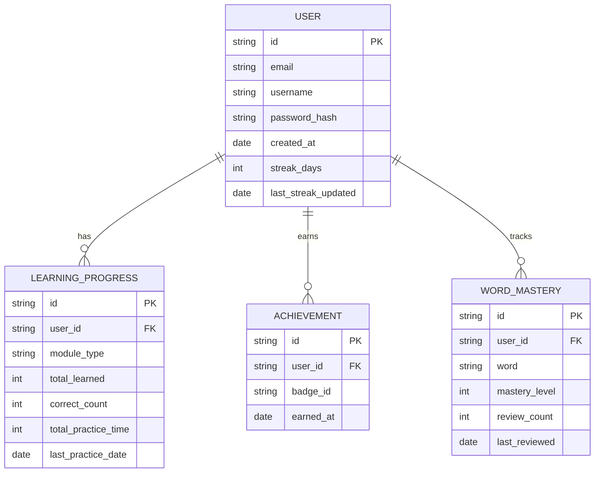

## 1. Architecture Design

```mermaid
graph TB
    subgraph Frontend["前端层"]
        A[React App]
        B[组件系统]
        C[状态管理 Zustand]
        D[路由 React Router]
        E[UI Tailwind CSS]
    end
    
    subgraph Data["数据层"]
        F[LocalStorage]
        G[SessionStorage]
    end
    
    subgraph Services["服务层"]
        H[Web Audio API]
        I[浏览器 Storage API]
    end
    
    A --&gt; B
    A --&gt; C
    A --&gt; D
    A --&gt; E
    C --&gt; F
    C --&gt; G
    B --&gt; H
    B --&gt; I
```

## 2. Technology Description
- **前端**: React@18 + TypeScript + Vite
- **初始化工具**: vite-init
- **后端**: 无后端，使用浏览器本地存储
- **数据库**: LocalStorage / SessionStorage
- **状态管理**: Zustand
- **路由**: React Router DOM
- **UI框架**: Tailwind CSS
- **图标**: Lucide React
- **音频处理**: Web Audio API / MediaRecorder API

## 3. Route Definitions
| Route | Purpose |
|-------|---------|
| / | 首页 - 学习仪表板 |
| /login | 登录页面 |
| /register | 注册页面 |
| /learn/vocabulary | 单词记忆模块 |
| /learn/grammar | 语法练习模块 |
| /learn/speaking | 口语跟读模块 |
| /progress | 学习进度页面 |
| /profile | 个人资料页面 |

## 4. Data Model

### 4.1 Data Model Definition



### 4.2 TypeScript Type Definitions

```typescript
// 用户相关类型
interface User {
  id: string;
  email: string;
  username: string;
  createdAt: Date;
  streakDays: number;
  lastStreakUpdated: Date;
}

// 学习进度类型
interface LearningProgress {
  id: string;
  userId: string;
  moduleType: 'vocabulary' | 'grammar' | 'speaking';
  totalLearned: number;
  correctCount: number;
  totalPracticeTime: number;
  lastPracticeDate: Date;
}

// 成就类型
interface Achievement {
  id: string;
  userId: string;
  badgeId: string;
  earnedAt: Date;
}

// 单词掌握度类型
interface WordMastery {
  id: string;
  userId: string;
  word: string;
  masteryLevel: number;
  reviewCount: number;
  lastReviewed: Date;
}

// 单词类型
interface Word {
  id: string;
  english: string;
  chinese: string;
  phonetic: string;
  example: string;
  difficulty: 'easy' | 'medium' | 'hard';
}

// 语法题目类型
interface GrammarQuestion {
  id: string;
  question: string;
  options: string[];
  correctAnswer: number;
  explanation: string;
  difficulty: 'easy' | 'medium' | 'hard';
}

// 口语练习类型
interface SpeakingExercise {
  id: string;
  text: string;
  phonetic: string;
  translation: string;
  difficulty: 'easy' | 'medium' | 'hard';
}
```

## 5. State Management (Zustand)

```typescript
interface AppState {
  // 用户状态
  user: User | null;
  isAuthenticated: boolean;
  
  // 学习状态
  currentModule: 'vocabulary' | 'grammar' | 'speaking' | null;
  learningProgress: LearningProgress[];
  achievements: Achievement[];
  wordMastery: WordMastery[];
  
  // 学习数据
  vocabularyWords: Word[];
  grammarQuestions: GrammarQuestion[];
  speakingExercises: SpeakingExercise[];
  
  // Actions
  login: (email: string, password: string) =&gt; Promise&lt;boolean&gt;;
  register: (email: string, username: string, password: string) =&gt; Promise&lt;boolean&gt;;
  logout: () =&gt; void;
  setCurrentModule: (module: 'vocabulary' | 'grammar' | 'speaking' | null) =&gt; void;
  updateProgress: (moduleType: string, correct: boolean) =&gt; void;
  updateWordMastery: (word: string, level: number) =&gt; void;
  unlockAchievement: (badgeId: string) =&gt; void;
}
```

## 6. Component Structure

```
src/
├── components/
│   ├── layout/
│   │   ├── Header.tsx
│   │   ├── Footer.tsx
│   │   └── Navigation.tsx
│   ├── learning/
│   │   ├── VocabularyCard.tsx
│   │   ├── GrammarQuiz.tsx
│   │   └── SpeakingRecorder.tsx
│   ├── ui/
│   │   ├── Button.tsx
│   │   ├── Card.tsx
│   │   └── ProgressBar.tsx
│   └── stats/
│       ├── StatsCard.tsx
│       └── AchievementBadge.tsx
├── pages/
│   ├── Home.tsx
│   ├── Login.tsx
│   ├── Register.tsx
│   ├── Vocabulary.tsx
│   ├── Grammar.tsx
│   ├── Speaking.tsx
│   ├── Progress.tsx
│   └── Profile.tsx
├── hooks/
│   ├── useAuth.ts
│   └── useLearning.ts
│   └── useStorage.ts
├── store/
│   └── useAppStore.ts
├── utils/
│   ├── constants.ts
│   ├── sampleData.ts
│   └── helpers.ts
├── types/
│   └── index.ts
├── App.tsx
├── main.tsx
└── vite-env.d.ts
```

## 7. Sample Data

### 7.1 Vocabulary Words
```typescript
export const sampleVocabulary: Word[] = [
  {
    id: '1',
    english: 'Serendipity',
    chinese: '意外发现珍奇事物的本领',
    phonetic: '/ˌserənˈdɪpɪti/',
    example: 'Finding that old photo was pure serendipity.',
    difficulty: 'hard'
  },
  // 更多单词...
];
```

### 7.2 Grammar Questions
```typescript
export const sampleGrammar: GrammarQuestion[] = [
  {
    id: '1',
    question: 'I ___ to the park yesterday.',
    options: ['go', 'goes', 'went', 'going'],
    correctAnswer: 2,
    explanation: 'yesterday 表示过去时间，要用一般过去时。',
    difficulty: 'easy'
  },
  // 更多题目...
];
```

### 7.3 Speaking Exercises
```typescript
export const sampleSpeaking: SpeakingExercise[] = [
  {
    id: '1',
    text: 'The quick brown fox jumps over the lazy dog.',
    phonetic: 'ðə kwɪk braʊn fɒks dʒʌmps ˈəʊvə ðə ˈleɪzi dɒɡ.',
    translation: '敏捷的棕色狐狸跳过了懒狗。',
    difficulty: 'medium'
  },
  // 更多练习...
];
```

## 8. Storage Implementation

使用 LocalStorage 存储用户数据和学习进度，键名如下：
- `language_learning_user`: 当前登录用户
- `language_learning_users`: 所有注册用户
- `language_learning_progress`: 学习进度数据
- `language_learning_achievements`: 成就数据
- `language_learning_word_mastery`: 单词掌握度数据
