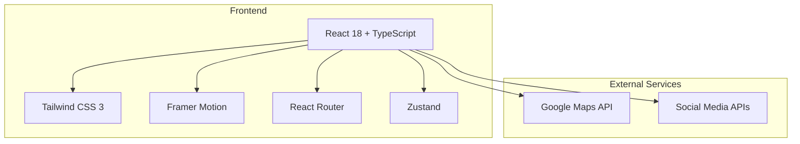

# 茶里九世官网 - 技术架构文档

## 1. 架构设计



## 2. 技术描述

- **前端**：React 18 + TypeScript + Tailwind CSS 3 + Framer Motion
- **构建工具**：Vite
- **路由**：React Router v6
- **状态管理**：Zustand
- **动画库**：Framer Motion
- **地图服务**：Google Maps API
- **图标库**：Lucide React

## 3. 路由定义

| 路由 | 路径 | 组件 | 描述 |
|------|------|------|------|
| 首页 | / | Home | 品牌主页，包含Hero区、产品展示、品牌故事等 |
| 产品页 | /products | Products | 产品列表页，支持分类筛选 |
| 产品详情页 | /products/:id | ProductDetail | 产品详细信息，规格选择 |
| 品牌故事页 | /brand | BrandStory | 品牌历程、理念介绍 |
| 门店页 | /stores | Stores | 门店地图、门店列表 |
| 新闻页 | /news | News | 品牌新闻、活动信息 |
| 会员中心 | /member | MemberCenter | 会员注册/登录、权益管理 |
| 登录页 | /login | Login | 用户登录 |
| 注册页 | /register | Register | 用户注册 |

## 4. 组件结构

```
src/
├── components/
│   ├── layout/
│   │   ├── Header.tsx         # 顶部导航栏
│   │   ├── Footer.tsx         # 页脚
│   │   └── Layout.tsx         # 布局容器
│   ├── hero/
│   │   └── Hero.tsx           # 首屏Hero区
│   ├── product/
│   │   ├── ProductCard.tsx    # 产品卡片
│   │   ├── ProductGrid.tsx     # 产品网格
│   │   └── ProductSection.tsx # 产品展示区
│   ├── brand/
│   │   ├── BrandStory.tsx      # 品牌故事
│   │   └── Timeline.tsx        # 品牌历程时间线
│   ├── features/
│   │   └── FeatureSection.tsx # 特色亮点区
│   ├── stores/
│   │   ├── StoreMap.tsx        # 门店地图
│   │   └── StoreCard.tsx       # 门店卡片
│   ├── social/
│   │   └── SocialSection.tsx   # 社交媒体区
│   └── ui/
│       ├── Button.tsx          # 按钮组件
│       ├── Card.tsx            # 卡片组件
│       └── Section.tsx         # 通用区块组件
├── pages/
│   ├── Home.tsx                # 首页
│   ├── Products.tsx            # 产品页
│   ├── ProductDetail.tsx       # 产品详情页
│   ├── BrandStory.tsx          # 品牌故事页
│   ├── Stores.tsx              # 门店页
│   ├── News.tsx                # 新闻页
│   ├── MemberCenter.tsx        # 会员中心
│   ├── Login.tsx               # 登录页
│   └── Register.tsx            # 注册页
├── hooks/
│   ├── useScroll.ts            # 滚动监听
│   ├── useParallax.ts          # 视差效果
│   └── useIntersectionObserver.ts # 元素可见性检测
├── utils/
│   ├── animations.ts           # 动画配置
│   └── helpers.ts              # 工具函数
├── data/
│   ├── products.ts             # 产品数据
│   ├── stores.ts               # 门店数据
│   └── news.ts                 # 新闻数据
├── App.tsx                     # 应用入口
└── main.tsx                    # 主渲染文件
```

## 5. 核心功能实现

### 5.1 顶部导航栏

- **实现方式**：固定定位，使用 `position: fixed`
- **滚动效果**：使用 `useScroll` hook 监听滚动，当滚动超过阈值时改变导航栏背景
- **移动端适配**：使用媒体查询，在小屏幕上显示汉堡菜单
- **动画**：背景变化使用 CSS transition，菜单项悬停使用下划线动画

### 5.2 Hero Section

- **实现方式**：全屏高度，使用 `min-h-screen`
- **背景**：视频背景或高质量图片，使用 `object-cover`
- **视差效果**：使用 `useParallax` hook 实现背景图片视差滚动
- **动画**：Slogan 淡入，CTA 按钮上浮，向下滚动箭头动画

### 5.3 产品展示区

- **实现方式**：响应式网格布局，使用 `grid` 和媒体查询
- **产品卡片**：图片占卡片70%，悬停时图片放大，卡片阴影加深
- **动画**：滚动时元素淡入，使用 `useIntersectionObserver` 触发动画

### 5.4 品牌故事区

- **实现方式**：分屏布局，使用 `grid` 或 `flex`
- **时间线**：使用绝对定位和伪元素实现垂直时间线
- **动画**：滚动时左右元素交错淡入

### 5.5 特色亮点区

- **实现方式**：横向排列的卡片，使用 `grid`
- **图标**：使用 Lucide React 图标库
- **动画**：滚动时元素从下往上淡入

### 5.6 门店信息区

- **实现方式**：地图嵌入 + 门店卡片列表
- **地图**：使用 Google Maps API
- **门店卡片**：包含图片、地址、营业时间
- **动画**：滚动时地图和卡片淡入

### 5.7 社交媒体/会员区

- **实现方式**：网格布局，包含二维码和社交图标
- **会员注册**：表单验证，成功提示
- **动画**：滚动时元素淡入，按钮悬停效果

### 5.8 页脚

- **实现方式**：深色背景，多列布局
- **快速链接**：分类导航链接
- **社交媒体图标**：使用 Lucide React 图标

## 6. 性能优化策略

### 6.1 图片优化

- **懒加载**：使用 `loading="lazy"` 属性
- **响应式图片**：使用 `srcset` 和 `picture` 标签
- **图片压缩**：使用优化后的图片格式和尺寸

### 6.2 代码优化

- **代码分割**：使用 React.lazy 和 Suspense
- **Tree Shaking**：移除未使用的代码
- **Bundle 分析**：使用 Vite 的 bundle 分析工具

### 6.3 动画性能

- **GPU 加速**：使用 `transform` 和 `opacity` 触发硬件加速
- **节流和防抖**：对滚动事件使用节流，对 resize 事件使用防抖
- **减少重排**：避免频繁操作 DOM

### 6.4 网络优化

- **资源预加载**：使用 `preload` 预加载关键资源
- **缓存策略**：合理设置缓存头
- **CDN 加速**：使用 CDN 分发静态资源

## 7. 可访问性实现

### 7.1 语义化 HTML

- 使用正确的 HTML 标签（header, nav, section, footer 等）
- 为图片添加 alt 属性
- 使用 ARIA 标签增强可访问性

### 7.2 键盘导航

- 确保所有交互元素可通过键盘访问
- 实现焦点管理，确保焦点顺序合理
- 为自定义控件添加键盘事件处理

### 7.3 对比度

- 确保文本和背景的对比度符合 WCAG AA 标准
- 使用 Tailwind 的颜色对比工具检查

### 7.4 屏幕阅读器

- 添加适当的 ARIA 标签
- 确保表单元素有正确的标签
- 测试屏幕阅读器兼容性

## 8. 部署策略

### 8.1 构建流程

- 使用 Vite 构建生产版本
- 配置环境变量
- 优化构建输出

### 8.2 部署平台

- 可部署到 Vercel、Netlify、AWS S3 等
- 配置 CI/CD 流程

### 8.3 监控和维护

- 添加错误监控
- 配置日志系统
- 定期更新依赖

## 9. 技术栈依赖

| 依赖 | 版本 | 用途 |
|------|------|------|
| react | ^18.2.0 | 前端框架 |
| react-dom | ^18.2.0 | DOM 渲染 |
| react-router-dom | ^6.22.0 | 路由管理 |
| zustand | ^4.5.0 | 状态管理 |
| framer-motion | ^11.0.0 | 动画库 |
| tailwindcss | ^3.4.0 | CSS 框架 |
| lucide-react | ^0.300.0 | 图标库 |
| @googlemaps/react-wrapper | ^1.1.35 | Google Maps 集成 |