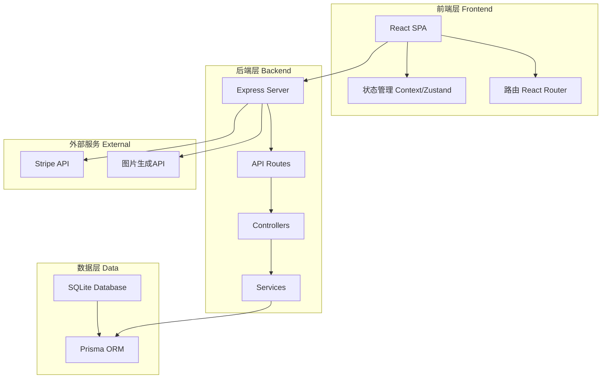
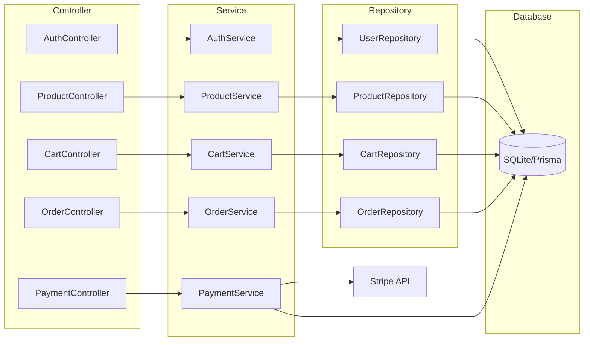
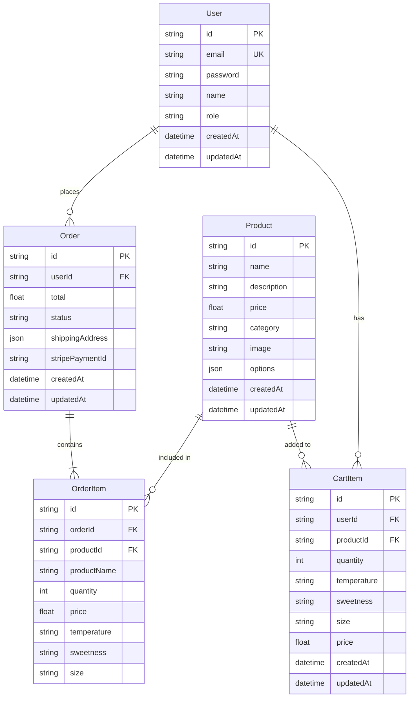

# 奶茶销售平台 - 技术架构文档

## 1. 架构设计



## 2. 技术说明

### 2.1 前端技术栈

- **框架**: React 18 + TypeScript
- **构建工具**: Vite
- **样式方案**: Tailwind CSS 3
- **路由**: React Router v6
- **状态管理**: Zustand (轻量级状态管理)
- **表单处理**: React Hook Form
- **HTTP客户端**: Axios
- **动画**: Framer Motion
- **图标**: Lucide React

### 2.2 后端技术栈

- **运行时**: Node.js
- **框架**: Express 4
- **数据库**: SQLite (开发) / PostgreSQL (生产可选)
- **ORM**: Prisma
- **认证**: JWT (jsonwebtoken)
- **密码加密**: bcrypt
- **支付**: Stripe SDK

### 2.3 开发工具

- **包管理器**: pnpm
- **代码规范**: ESLint + Prettier
- **类型检查**: TypeScript

## 3. 路由定义

### 3.1 前端路由

| 路由 | 用途 | 权限 |
|------|------|------|
| `/` | 首页，品牌展示和精选产品 | 公开 |
| `/products` | 产品目录页 | 公开 |
| `/products/:id` | 产品详情页 | 公开 |
| `/cart` | 购物车页 | 公开 |
| `/checkout` | 结账页 | 需登录 |
| `/checkout/success` | 支付成功页 | 需登录 |
| `/orders` | 订单历史页 | 需登录 |
| `/orders/:id` | 订单详情页 | 需登录 |
| `/login` | 登录页 | 公开 |
| `/register` | 注册页 | 公开 |
| `/admin` | 管理后台首页 | 管理员 |
| `/admin/products` | 产品管理 | 管理员 |
| `/admin/orders` | 订单管理 | 管理员 |

### 3.2 后端API路由

| 方法 | 路由 | 用途 |
|------|------|------|
| POST | `/api/auth/register` | 用户注册 |
| POST | `/api/auth/login` | 用户登录 |
| GET | `/api/auth/me` | 获取当前用户 |
| GET | `/api/products` | 获取产品列表 |
| GET | `/api/products/:id` | 获取单个产品 |
| POST | `/api/products` | 创建产品(管理员) |
| PUT | `/api/products/:id` | 更新产品(管理员) |
| DELETE | `/api/products/:id` | 删除产品(管理员) |
| GET | `/api/cart` | 获取购物车 |
| POST | `/api/cart/items` | 添加购物车商品 |
| PUT | `/api/cart/items/:id` | 更新购物车商品 |
| DELETE | `/api/cart/items/:id` | 删除购物车商品 |
| POST | `/api/orders` | 创建订单 |
| GET | `/api/orders` | 获取用户订单列表 |
| GET | `/api/orders/:id` | 获取订单详情 |
| PUT | `/api/orders/:id/status` | 更新订单状态(管理员) |
| POST | `/api/payment/create-checkout-session` | 创建Stripe支付会话 |
| POST | `/api/payment/webhook` | Stripe webhook回调 |

## 4. API定义

### 4.1 数据类型定义

```typescript
interface User {
  id: string;
  email: string;
  password: string;
  name: string;
  role: 'user' | 'admin';
  createdAt: Date;
  updatedAt: Date;
}

interface Product {
  id: string;
  name: string;
  description: string;
  price: number;
  category: 'fruit_tea' | 'milk_tea' | 'pure_tea';
  image: string;
  options: ProductOption[];
  createdAt: Date;
  updatedAt: Date;
}

interface ProductOption {
  temperature: ('hot' | 'cold')[];
  sweetness: ('full' | 'seventy' | 'fifty' | 'thirty' | 'none')[];
  size: ('medium' | 'large' | 'extra_large')[];
}

interface CartItem {
  id: string;
  productId: string;
  product: Product;
  quantity: number;
  temperature: string;
  sweetness: string;
  size: string;
  price: number;
}

interface Order {
  id: string;
  userId: string;
  items: OrderItem[];
  total: number;
  status: 'pending' | 'paid' | 'preparing' | 'ready' | 'completed' | 'cancelled';
  shippingAddress: ShippingAddress;
  stripePaymentId?: string;
  createdAt: Date;
  updatedAt: Date;
}

interface OrderItem {
  productId: string;
  productName: string;
  quantity: number;
  price: number;
  temperature: string;
  sweetness: string;
  size: string;
}

interface ShippingAddress {
  name: string;
  phone: string;
  address: string;
  city: string;
  postalCode: string;
}
```

### 4.2 请求/响应示例

```typescript
// POST /api/auth/register
interface RegisterRequest {
  email: string;
  password: string;
  name: string;
}
interface RegisterResponse {
  user: Omit<User, 'password'>;
  token: string;
}

// POST /api/cart/items
interface AddToCartRequest {
  productId: string;
  quantity: number;
  temperature: string;
  sweetness: string;
  size: string;
}

// POST /api/orders
interface CreateOrderRequest {
  shippingAddress: ShippingAddress;
  items: CartItem[];
}

// POST /api/payment/create-checkout-session
interface CreateCheckoutRequest {
  orderId: string;
}
interface CreateCheckoutResponse {
  checkoutUrl: string;
}
```

## 5. 服务器架构图



## 6. 数据模型

### 6.1 数据模型定义



### 6.2 Prisma Schema

```prisma
datasource db {
  provider = "sqlite"
  url      = "file:./dev.db"
}

generator client {
  provider = "prisma-client-js"
}

model User {
  id        String     @id @default(uuid())
  email     String     @unique
  password  String
  name      String
  role      String     @default("user")
  cartItems CartItem[]
  orders    Order[]
  createdAt DateTime   @default(now())
  updatedAt DateTime   @updatedAt
}

model Product {
  id          String     @id @default(uuid())
  name        String
  description String
  price       Float
  category    String
  image       String
  options     String
  cartItems   CartItem[]
  orderItems  OrderItem[]
  createdAt   DateTime   @default(now())
  updatedAt   DateTime   @updatedAt
}

model CartItem {
  id          String   @id @default(uuid())
  userId      String
  productId   String
  quantity    Int
  temperature String
  sweetness   String
  size        String
  price       Float
  user        User     @relation(fields: [userId], references: [id], onDelete: Cascade)
  product     Product  @relation(fields: [productId], references: [id])
  createdAt   DateTime @default(now())
  updatedAt   DateTime @updatedAt

  @@unique([userId, productId, temperature, sweetness, size])
}

model Order {
  id              String       @id @default(uuid())
  userId          String
  total           Float
  status          String       @default("pending")
  shippingAddress String
  stripePaymentId String?
  items           OrderItem[]
  user            User         @relation(fields: [userId], references: [id])
  createdAt       DateTime     @default(now())
  updatedAt       DateTime     @updatedAt
}

model OrderItem {
  id          String @id @default(uuid())
  orderId     String
  productId   String
  productName String
  quantity    Int
  price       Float
  temperature String
  sweetness   String
  size        String
  order       Order  @relation(fields: [orderId], references: [id], onDelete: Cascade)
  product     Product @relation(fields: [productId], references: [id])
}
```

## 7. 项目目录结构

```
/workspace
├── src/
│   ├── client/                 # 前端代码
│   │   ├── src/
│   │   │   ├── components/     # 可复用组件
│   │   │   │   ├── ui/         # 基础UI组件
│   │   │   │   ├── layout/     # 布局组件
│   │   │   │   └── product/    # 产品相关组件
│   │   │   ├── pages/          # 页面组件
│   │   │   ├── hooks/          # 自定义hooks
│   │   │   ├── store/          # 状态管理
│   │   │   ├── services/       # API服务
│   │   │   ├── types/          # 类型定义
│   │   │   ├── utils/          # 工具函数
│   │   │   ├── styles/         # 全局样式
│   │   │   ├── App.tsx
│   │   │   └── main.tsx
│   │   ├── index.html
│   │   ├── tailwind.config.js
│   │   ├── vite.config.ts
│   │   └── package.json
│   │
│   └── server/                 # 后端代码
│       ├── src/
│       │   ├── controllers/    # 控制器
│       │   ├── services/       # 业务逻辑
│       │   ├── repositories/   # 数据访问
│       │   ├── middleware/     # 中间件
│       │   ├── routes/         # 路由定义
│       │   ├── types/          # 类型定义
│       │   ├── utils/          # 工具函数
│       │   ├── prisma/         # Prisma schema
│       │   └── index.ts        # 入口文件
│       └── package.json
│
├── package.json                # 根package.json (workspace配置)
└── .trae/
    └── documents/              # 文档目录
```

## 8. 环境变量

### 8.1 前端环境变量

```env
VITE_API_URL=http://localhost:3001/api
VITE_STRIPE_PUBLISHABLE_KEY=pk_test_xxx
```

### 8.2 后端环境变量

```env
DATABASE_URL="file:./dev.db"
JWT_SECRET=your-super-secret-jwt-key
STRIPE_SECRET_KEY=sk_test_xxx
STRIPE_WEBHOOK_SECRET=whsec_xxx
FRONTEND_URL=http://localhost:5173
```

## 9. 部署说明

### 9.1 开发环境

```bash
# 安装依赖
pnpm install

# 初始化数据库
pnpm --filter server prisma migrate dev
pnpm --filter server prisma db seed

# 启动开发服务器
pnpm dev
```

### 9.2 生产构建

```bash
# 构建前端
pnpm --filter client build

# 构建后端
pnpm --filter server build

# 启动生产服务器
pnpm start
```

## 10. 安全考虑

- **密码安全**: 使用bcrypt加密，salt rounds = 10
- **JWT安全**: Token有效期24小时，支持刷新
- **API安全**: 所有敏感操作需验证JWT
- **CORS配置**: 仅允许指定域名访问
- **输入验证**: 使用Zod进行请求验证
- **SQL注入防护**: Prisma ORM自动防护
